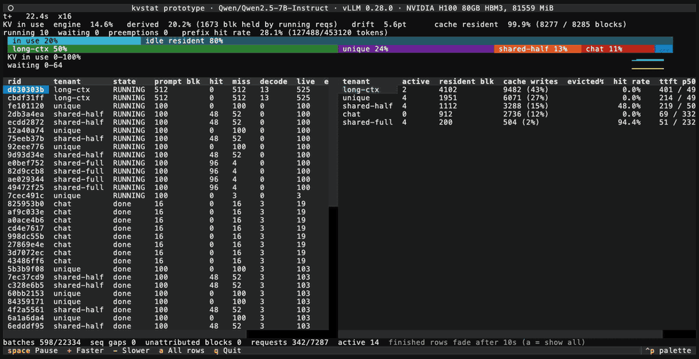

# kvstat

**See inside vLLM's KV cache, request by request.**



*Prototype playing back a recorded session at 16× speed: vLLM 0.28.0, Qwen2.5-7B-Instruct on one H100, five request classes, a preemption storm.*

kvstat attaches to a running [vLLM](https://github.com/vllm-project/vllm) server and shows what is happening inside its KV cache right now: which requests hold which blocks, which ones are hitting the prefix cache, which one was just preempted, and why TTFT spiked when it happened. Dashboards show the totals; kvstat shows the requests behind them.

It rebuilds this view from vLLM's KV cache event stream (`--kv-events-config`), the same stream KV-aware routers rely on, and keeps cross-checking it against vLLM's own Prometheus metrics. When the two disagree, the screen flags it, so you always know how much to trust what you see.

## What v1 shows

- **KV occupancy map** — who holds how many blocks, how fragmented the pool is, how much headroom is left.
- **Prefix-cache attribution** — which requests ride cached prefixes and which pay full prefill.
- **Preemption timeline** — evictions and recomputes lined up against queue depth and TTFT spikes.
- **Status bar with error bounds** — state age, reconcile drift, dropped batches.
- **Record & play back** — capture the event stream to a file, open it in the TUI later.

Not a benchmark, autotuner, router, or Grafana replacement. Single vLLM instance first.

## Usage

Start vLLM with KV events on, then record the stream and its metrics to a file:

```bash
vllm serve <model> --kv-events-config '{"enable_kv_cache_events": true, "publisher": "zmq", "replay_endpoint": "tcp://*:5558"}'
kvstat record --replay-endpoint tcp://127.0.0.1:5558 --out run.jsonl.gz
```

The capture keeps the raw event batches, so any later kvstat can read it. Add
`--redact-tokens` before sharing one: events carry prompt token ids.

## Development

```bash
uv sync
uv run kvstat --help
uv run pytest
```

## License

Apache-2.0. See [LICENSE](LICENSE).
